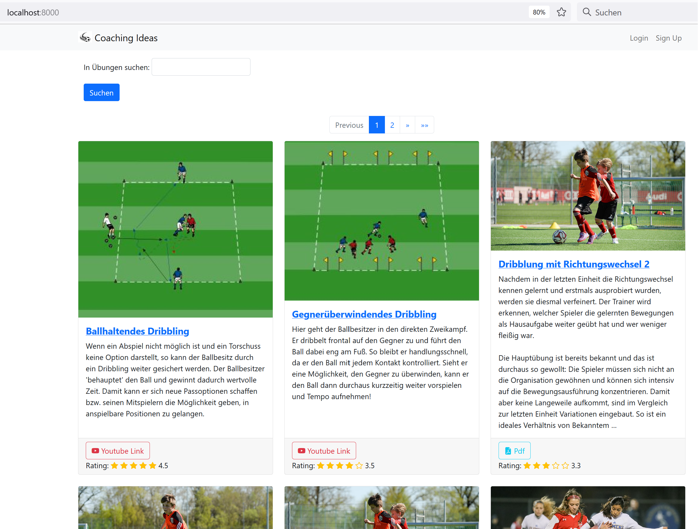
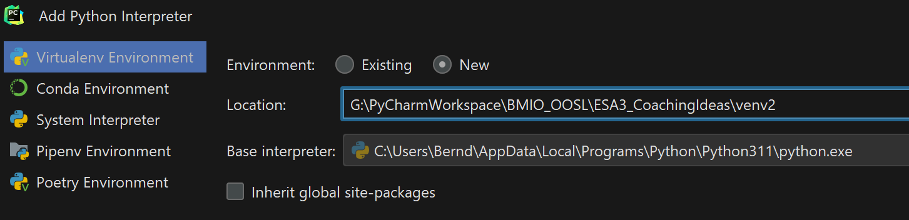
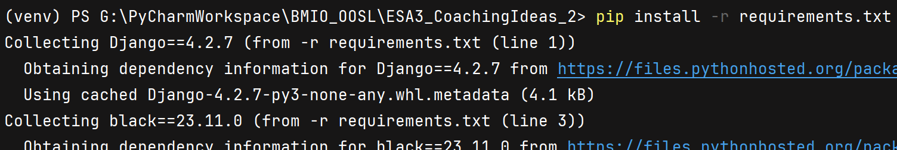
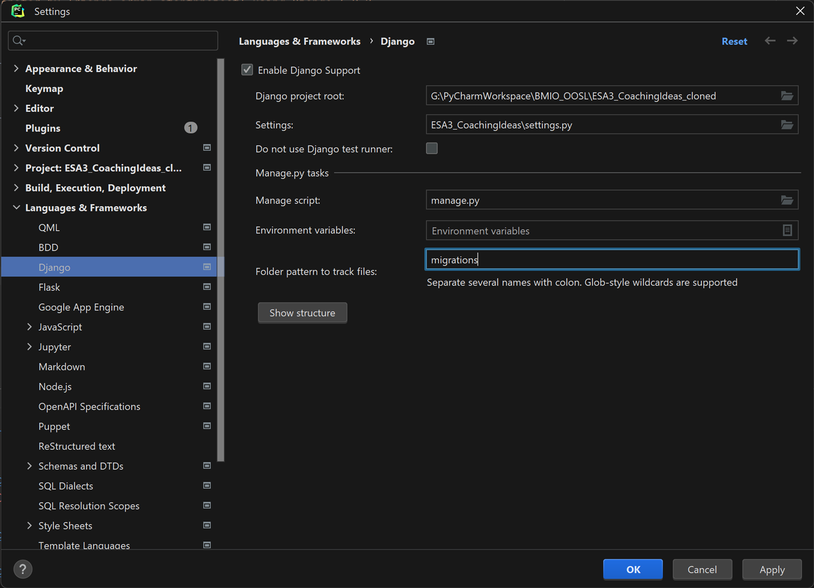
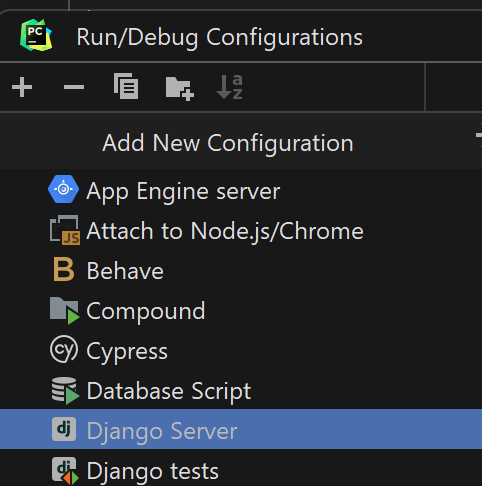
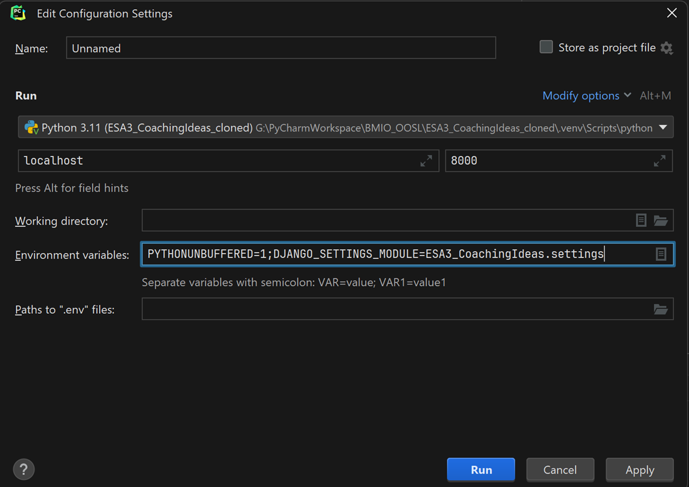
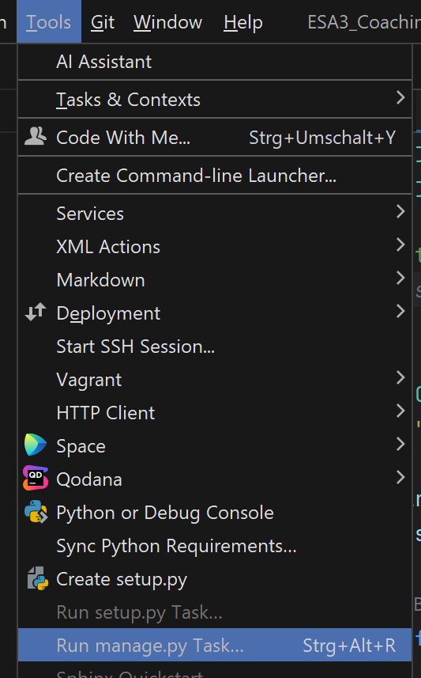
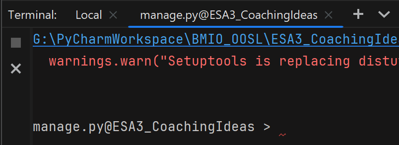

# Semester-Projekt für BMIO-Modul: Objektorientierte Skriptsprachen

### Thema: Plattform zur Bereitstellung von Trainingsinhalten für die Jugendarbeit eines Sportvereins (Schwerpunkt Fußball)
### Team: Marco Wöhlert, Bernd Meißner
### Technologie: Django-Framework

**Ziel des Projektes** ist die Entwicklung einer Web-Anwendung, um die ehrenamtliche 
Trainingsarbeit in einem kleinen Sportverein zu unterstützen. 

Die Suche nach passenden (alters- und leistungsstandgerecht) Trainingsinhalten erfordert 
viel Zeit und Erfahrung. Beide Faktoren sind bei ehrenamtlich tätigen Trainern oftmals 
sehr knapp bemessen. 
Um ihre Arbeit zu vereinfachen, soll die Plattform die Beschreibung bewährter 
Übungen/Trainingsinhalte bereitstellen (Textdokumente mit Bildern, Videos). 
Die Inhalte sollen von den Trainern des Vereins selber bereitgestellt und hochgeladen werden. 
Dabei erfolgt eine Klassifizierung hinsichtlich Trainingsschwerpunkt und passende Altersgruppe.
Die Inhalte sollen nach Begriffen durchsucht werden können und herunterladbar sein.


## Setup

Das Projekt ist mit einer sqlite-Datenbank-Datei gespeichert, die einige Beispieldatensätze enthält.
Dazu gehören auch einige Bilder/pdf-Dateien, die unter /media abgespeichert sind.

Grundsätzlich sollte die App nach dem Start etwas anzeigen wie:


### Virtual Env
- Python 3.11



- Install required packages
```shell
$ pip install -r requirements.txt
```



### Configure Django Project for IDE (PyCharm)



### Run Configuration to start app from IDE



DJANGO_SETTINGS_MODULE in den Environment variables setzen!



## Notes for Development only!
### Database
- start manage.py terminal





- Migrations
```shell
$ makemigrations
$ migrate
```

- Für ein paar Dummy Daten (ohne Dateien)
```shell
seed exercise --number=3
```


### Generate requirements.txt from imports only (no dev tools)
```shell
$ pipreqs --force
```

```shell
$ createsuperuser
```

Reset DB and populate with fake data:

- install packages: django-seed, psycopg2
- delete all wxyz_*.py files in /migrations
- in manage.py@terminal:

```shell
$ reset_db --noinput
$ makemigrations exercise
$ migrate exercise
$ seed exercise --number=3
```


