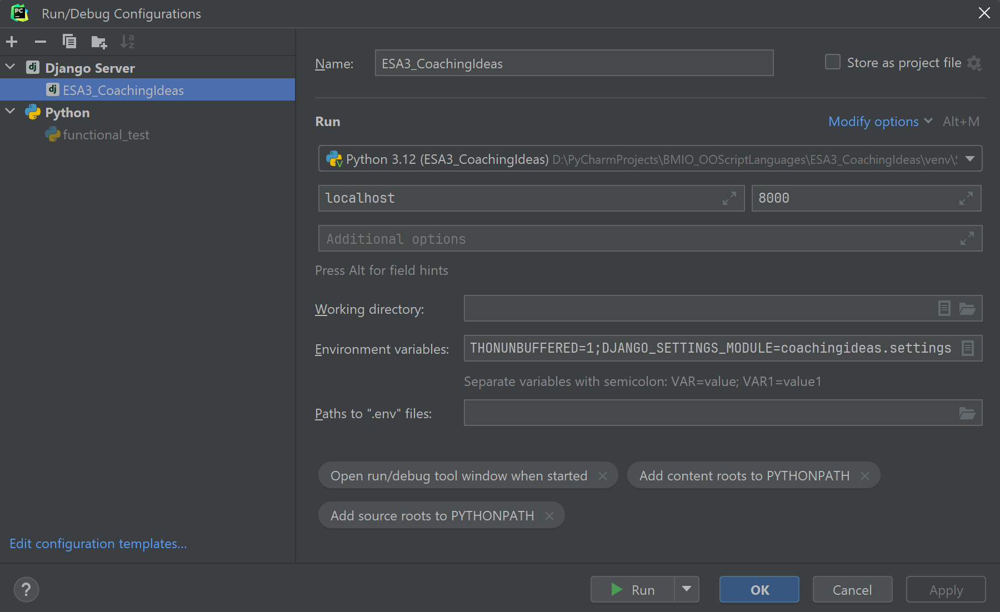

# Semester Project With Django

Follow the instructions ...

## Setup

### Virtual Env
- Python 3.11


- Install required packages
```shell
$ pip install -r requirements.txt
```


### Configure Django Project for IDE (PyCharm)


### Run Configuration to start app from IDE


DJANGO_SETTINGS_MODULE in den Environment variables setzen!



### Database
- start manage.py terminal


- Migrations
```shell
$ makemigrations
$ migrate
```

- Für ein paar Dummy Daten (ohne Dateien)
```shell
seed exercise --number=3
```

## Notes for Development
### Generate requirements.txt from imports only (no dev tools)
```shell
$ pipreqs --force
```

```shell
$ createsuperuser
```

Reset DB and populate with fake data:

- install packages: django-seed, psycopg2
- delete all wxyz_*.py files in /migrations
- in manage.py@terminal:

```shell
$ reset_db --noinput
$ makemigrations exercise
$ migrate exercise
$ seed exercise --number=3
```


